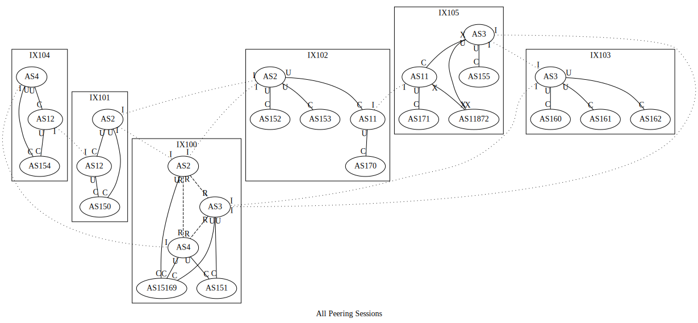

# Mini Internet

This is one of the more sophisticated examples; here, we combine what we have used from previous examples and build a larger simulation. In this example, we will set up:

- Three tier-1 transit providers: AS2, AS3, and AS4 (buy transit from no one, peer with each other), 
- one tier-2 transit provider, AS11 (buy transit from AS2 and AS3),
- some content provider and service ASes:
    - AS150: web server, recursive DNS resolver,
    - AS151: web server,
    - AS152: web server,
    - AS153: recursive DNS resolver,
    - AS154: reverse DNS (`in-addr.arpa.`),
    - AS155: Cymru IP ASN origin service,
    - AS160: root DNS,
    - AS161: `.com`, `.net` and `.arpa` TLD DNS,
    - AS162: `as150.net`, `as151.net` and `as152.net` DNS,
    - AS171 & AS172: end-user ASes for OpenVPN access,
    - AS15169 (Google): "Google" recursive DNS resolver, announces the `8.8.8.0/24` prefix, to host the resolver on `8.8.8.8`, and,
    - AS11872 (Syracuse University): real-world AS (announces the prefixes announced by AS11872 in the real-world, and route it to the real-world). 
- six internet exchanges (100-105), and
- DNSSEC for `as150.net`, `as151.net` and `as152.net`.

The topology is rather complex; here's the Graphviz output of the `Bgp` layer:

Each edge indicates a BGP session. 

- Regular lines indicate regular BGP sessions.
- Dashed lines indicate MLPA (Multi-Lateral Peering Agreement) peering, or route-server peering sessions.
- Dotted lines indicate internal peering sessions (IBGP).

The heads and tails of edges are labeled with one of the following labels:

- `C` means this end is the customer end of a provider-customer transit session.
- `U` means this end is the upstream (i.e., the provider) end of a provider-customer transit session.
- `P` means the session is a regular peering session.
- `R` means the session is an MLPA (Multi-Lateral Peering Agreement) peering, or route-server peering sessions. It is functionally the same as the `P` sessions.
- `X` means the session has an unspecified role; this will be explained later.