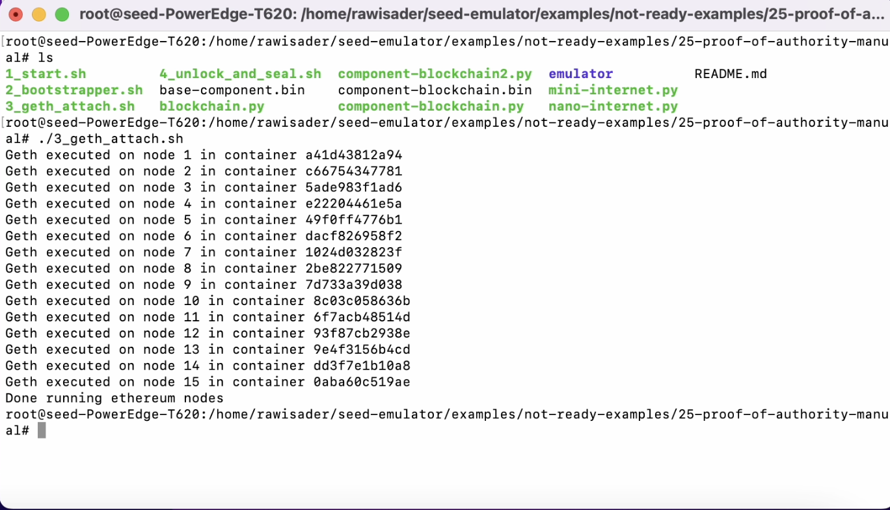
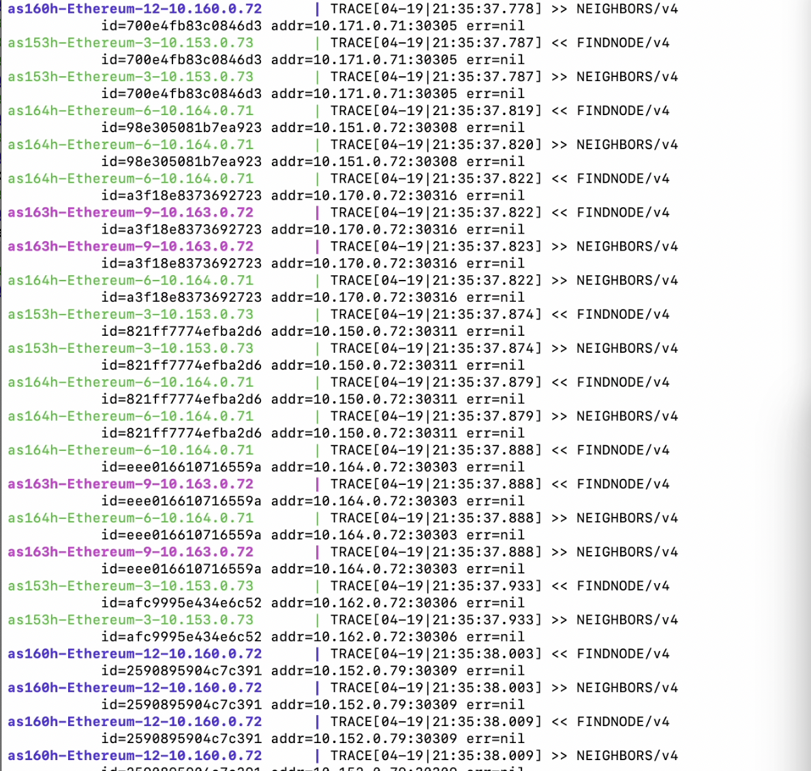
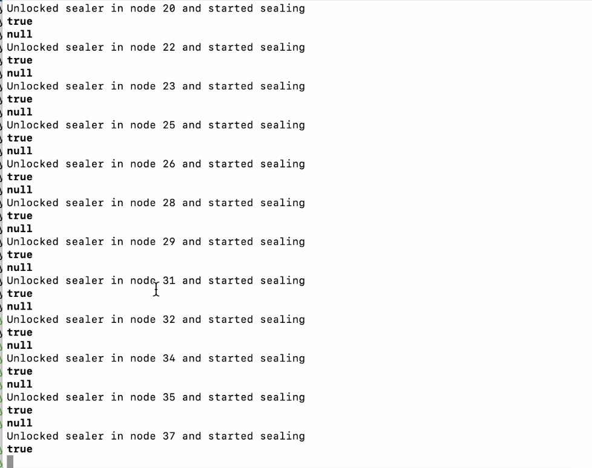

## Features
- Manual execution
- Selecting a consensus mechanism
- Creating prefunded accounts

## Manual exection part 1
- The feature was added to understand the underlying logic of the blockchain emulator
- Like any other blockchain example, start by running `mini-internet.py`. You should find in your directory a `base-component.bin`
- After that, you need to update your `component-blockchain.py`
- At the top of the `component-blockchain.py`, you can find the python statements which creates a new instance of the `EthereumService`
- This constructor takes as one of its parameters the `manual` flag.
- This flag has a default value of `False`, so if it is not explicitely set as `True` as the constructor parameter, the blockchain execution will be automated by us.
- The file should look something like the picture below

## Selecting a consensus mechanism
- We provide two APIs to select the consensus mechanism: `setBaseConsensusMechanism` and `setBaseConsensusMechanism`
- The former API is a method of the EthereumService class
- It is called in the following way: `eth.setBaseConsensusMechanism(<consensus>)`
- The `<consensus>` parameter can as of know be one of two values: `ConsensusMechanism.POA` or `ConsensusMechanism.POW`. This is because we only support the `Proof of authority (clique)` and the `Proof of work`.
- The `setBaseConsensusMechanism` API is applied on all the ethereum nodes unless we set a different consensus on a certain node using the `setConsensusMechanism`.
- To apply a certain consensus to a virtual node, we would do it in this way: `e = e.install("eth"); e.setConsensusMechanism(<consensus>)`

## Port Forwarding
- We can currently open one of two ports on the containers when running the example
- Port 8545 which is the default HTTP port. This one is used to connect the Remix IDE to our emulator
- Port 8546 which is the default WS port. This one is used for the visualization as event subscriptions are only supported when connected using websockets

## Creating prefunded accounts

## component-blockchain.py output
- After configuring your network, the output of this file should should be similar to the picture below

## Building the example
- At this point we should run the `blockchain.py` file which will generate an `emulator` folder
- Go to the folder and run `dcbuild` and `dcup`
- You will know that the emulator is ready when you see an output similar to the picture below

## Manual execution part 2
- At this point, it is only the emulator that is running. We need to run the bash scripts on our host machine to trigger the blockchain execution
- We provide 3 bash scripts: `2_bootstrapper.sh`, `3_geth_attach.sh`, `4_unlock_and_seal.sh`
- You need to run these files sequentially
- `2_bootstrapper.sh` makes sure all containers have the bootnodes urls inside a file called `eth-node-urls`
- Once you run this file, you should see an output similar to the picture below

- `3_geth_attach.sh` runs the `geth` command to run the ethereum nodes on each container
- It is only after you run the `geth` command on the containers that the blockchain network starts running
- Once you run this file, you shoud see an output similar to the picture below

- You should also see the following output on the same terminal you used the `dcup` command

- `4_unlock_and_seal.sh` unlocks the ethereum accounts inside the containers and runs the miner/sealer
- Once you run this file, you should see an output similar to the picture below

